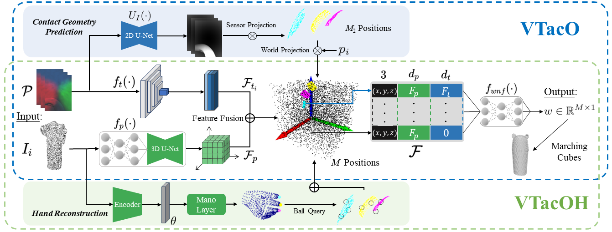

# Visual-Tactile Sensing for In-Hand Object Reconstruction
[**Paper**](https://arxiv.org/pdf/2303.14498.pdf) | [**Project Page**](https://sites.google.com/view/vtaco) <br>

<div style="text-align: center">

</div>

This repository contains the implementation of the paper:

**Visual-Tactile Sensing for In-Hand Object Reconstruction**  
Wenqiang Xu*, Zhenjun Yu*, Han Xue, Ruolin Ye, Siqiong Yao, Cewu Lu (* = Equal contribution)  
**CVPR 2023**  

If you find our code or paper useful, please consider citing
```bibtex
@inproceedings{xu2023visual,
  title={Visual-Tactile Sensing for In-Hand Object Reconstruction},
  author={Xu, Wenqiang and Yu, Zhenjun and Xue, Han and Ye, Ruolin and Yao, Siqiong and Lu, Cewu},
  booktitle={Proceedings of the IEEE/CVF Conference on Computer Vision and Pattern Recognition},
  pages={8803--8812},
  year={2023}
}

```

## Installation
This code is only tested on Ubuntu, we will soon test it on Windows system. 
First you have to make sure that you have all dependencies in place.
The simplest way to do so, is to use [anaconda](https://www.anaconda.com/). 

You can create an anaconda environment called `vtaco` using
```
conda env create -f environment.yaml
conda activate vtaco
```

**Note**: You might need to install **torch-scatter** mannually following [the official instruction](https://github.com/rusty1s/pytorch_scatter#pytorch-140):
```
pip install torch-scatter==2.0.4 -f https://pytorch-geometric.com/whl/torch-1.4.0+cu101.html
```

Next, compile the extension modules.
You can do this via
```
python setup.py build_ext --inplace
```


## Dataset
We are uploading the dataset, which will be available on https://huggingface.co/datasets/robotflow/vtaco/  
You can follow the instructions to download the dataset for training and testing dataset for VTacO and VTacOH.

## VT-Sim
We will soon release the Simulation environment VT-Sim!

## Training
To train the Depth Estimator $U_I(\cdot)$ and the sensor pose estimator, we provide a config file `configs/tactile/tactile_test.yaml`, you can run the following command to train from scratch:
```
python train_depth.py configs/tactile/tactile_test.yaml
```

With the pretrained model of $U_I(\cdot)$ and the sensor pose estimator, examples for training VTacO or VTacOH are as follows: 
```
python train.py configs/VTacO/VTacO_YCB.yaml
python train.py configs/VTacOH/VTacOH_YCB.yaml
```
**Note**: you might need to change *path* in *data*, and *model_file* in *encoder_t2d_kwargs* of the config file, to your data path and pretrained model path.  

All the results will be saved in `out/` folder, including checkpoints, visualization results and logs for tensorboard.
